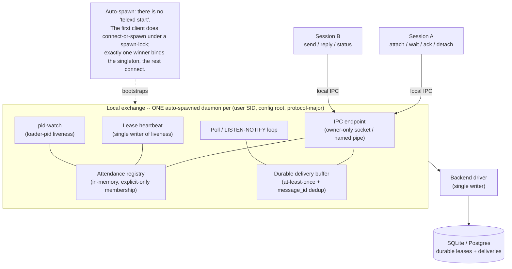
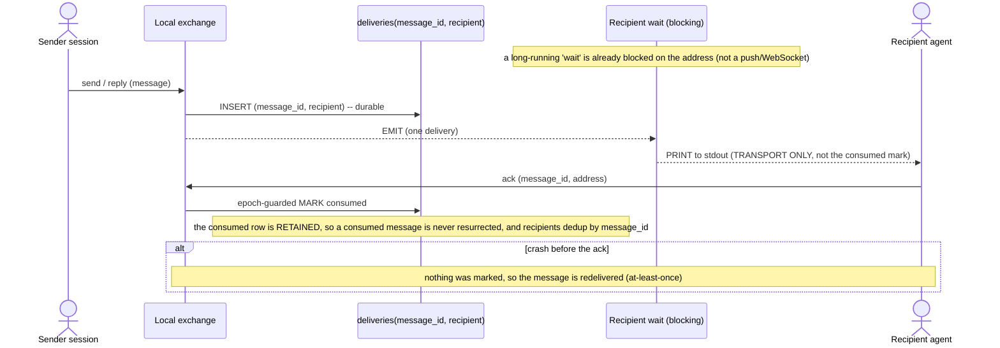
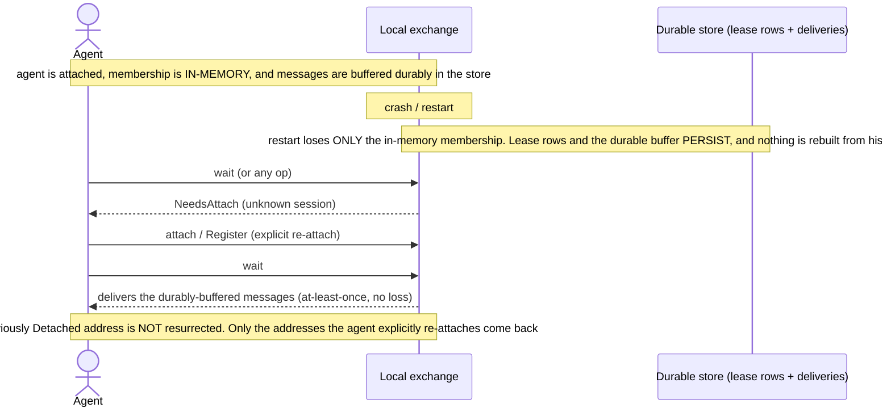
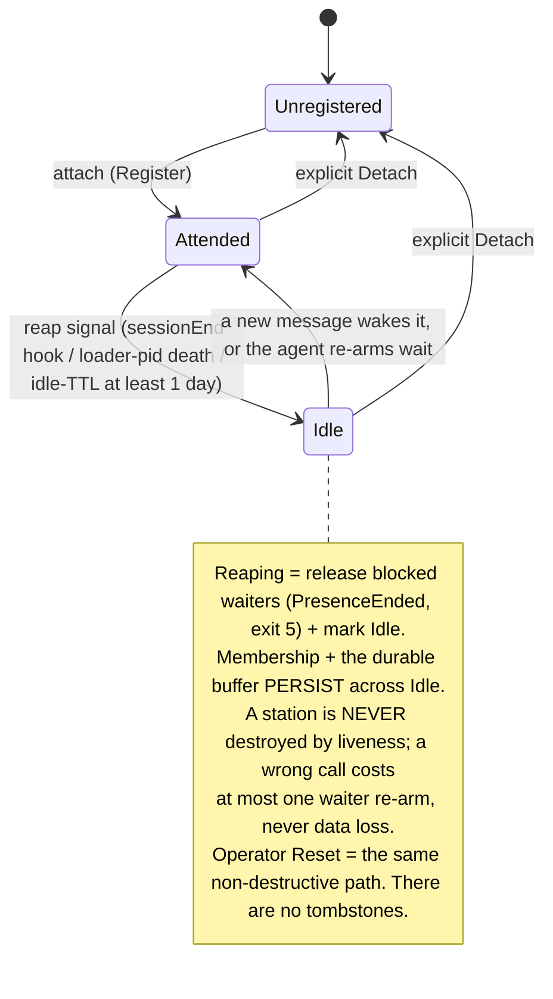
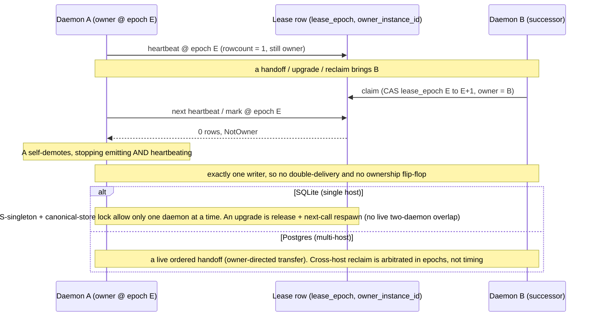

# Telex Local Exchange -- Architecture Overview (visual)

> **Non-normative explanatory diagrams.** These teach the local-exchange architecture; the
> governing specification is [`daemon.md`](daemon.md). **If any diagram conflicts with `daemon.md`,
> `daemon.md` wins.** Each diagram below names the `daemon.md` section(s) it is drawn from.

This is the **visual on-ramp** to the daemon design: read it before the normative contract to build
a mental model, then drop into [`daemon.md`](daemon.md) for the precise rules. Five diagrams, in
learning order:

1. **Component map** -- what the pieces are and how the daemon comes to exist.
2. **Message delivery** -- how a message reaches a recipient at-least-once, and when it is "consumed".
3. **Restart & re-attach** -- what a daemon restart loses vs. retains, and how a station recovers.
4. **Station liveness** -- how a station is deemed idle, and why that is never destructive.
5. **Single-writer correctness** -- how exactly one writer per store is guaranteed across restart,
   upgrade, and multi-host.

The word **epoch** appears by name in diagrams 2-4 and is *defined* in diagram 5.

---

## 1. Local exchange component map

**Answers:** What are the pieces, where is the per-user singleton boundary, and how does the daemon
come to exist with no manual start command?

Sessions run **one-shot verbs** (no resident process). A **station** is a registration in the
exchange: a durable lease row plus the in-memory attendance record. The exchange is the only writer
of liveness/delivery state for its store.

*Governing spec:* [daemon.md sec.1](daemon.md#1-the-local-exchange) ,
[sec.2.2 auto-spawn](daemon.md#22-auto-spawn-connect-or-spawn-and-the-spawn-lock) | Last reviewed: 2026-06-24

---

## 2. Message delivery & the at-least-once fence

**Answers:** How does a message reach a recipient at-least-once, and when is it "consumed"?

The durable `deliveries` row is the dedup source of truth. The **stdout PRINT is transport only**;
the **agent's explicit `ack` is the durable fence** (a single ack -- there is no separate waiter
`DeliveryAck`). "Consumed" is decided by the agent, epoch-guarded so a superseded daemon cannot mark.

*Governing spec:* [daemon.md sec.11.3 delivery fence](daemon.md#113-server-side-delivery-fence-mr1--at-least-once-preserving) ,
[sec.13 dedup](daemon.md#13-delivery-and-seen-dedup) | Last reviewed: 2026-06-24

---

## 3. Restart & re-attach recovery

**Answers:** After a daemon restart, what is lost vs. retained, and how does a station regain
membership?

Recovery is an **ordered handshake**, not an automatic rebuild: the exchange never reverse-indexes
durable rows into membership. The agent is told (`NeedsAttach`) and re-establishes exactly the
addresses it wants.

*Governing spec:* [daemon.md sec.14.3 crash recovery](daemon.md#143-crash-recovery-and-re-attach) ,
[sec.14.4 NeedsAttach](daemon.md#144-wait-and-re-attach-on-needsattach) | Last reviewed: 2026-06-24

---

## 4. Station liveness states (non-destructive reaping)

**Answers:** How is a station deemed idle, and why is that never destructive?

Liveness is a **non-destructive UX dial, not a correctness gate**. There is deliberately **no
Destroyed state**: a station can idle for days and wake on the next message.

*Governing spec:* [daemon.md sec.9 liveness](daemon.md#9-liveness-model) ,
[sec.10 reaping + idle-TTL](daemon.md#10-reaping-and-the-idle-ttl-backstop) | Last reviewed: 2026-06-24

---

## 5. Single-writer correctness: the epoch fence + ownership handoff

**Answers:** How does telex guarantee exactly one writer per store across restart, upgrade, and
multi-host?

An **epoch** is the single-writer fence: a monotonic `lease_epoch` plus the owning daemon's
`owner_instance_id`. A successor wins by atomically incrementing the epoch; the old owner discovers
it has been superseded on its next write and steps down.

Three layers enforce single-writer: the **OS-singleton** (per config root), a **canonical-store
lock** (per SQLite store), and the **lease-epoch fence** (the multi-writer Postgres authority).

*Governing spec:* [daemon.md sec.11 lease-epoch fence](daemon.md#11-lease-epoch-fence-the-spine) ,
[sec.11.4 ordered handoff](daemon.md#114-ordered-handoff--owner-directed-atomic-transfer-sf3) | Last reviewed: 2026-06-24

---

## Keeping these honest (drift policy)

These diagrams are explanatory companions, capped at **5** to stay maintainable:

- **One question per diagram**; a diagram may not introduce states or terms not justified by its
  `Governing spec` footer anchors.
- **Update trigger.** A PR that changes daemon semantics, the referenced `daemon.md` anchors, or the
  code implementing delivery, attach/re-attach, liveness/reaping, or lease/single-writer behavior
  must update this file (or state why no diagram changed).
- **Restamp.** Refresh each `Last reviewed` date when a diagram is re-verified against its anchors;
  a sweep restamps or removes stale diagrams.
- `daemon.md` remains the single source of truth; these never encode a contract that is not already
  in it.
