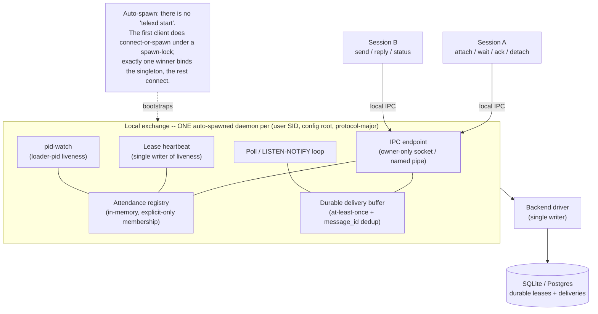
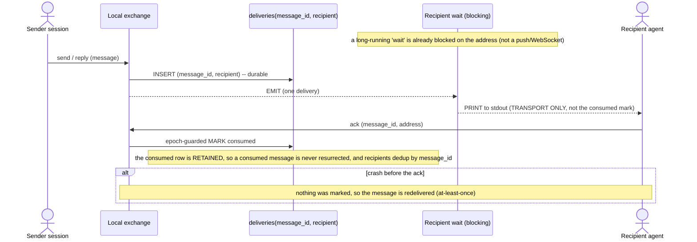
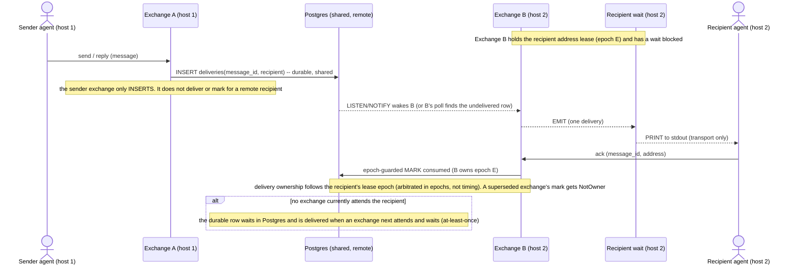
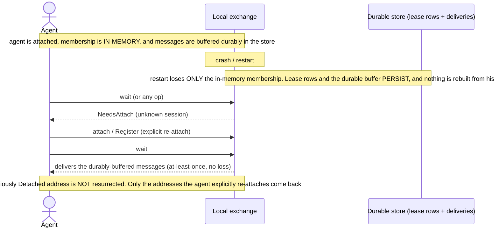
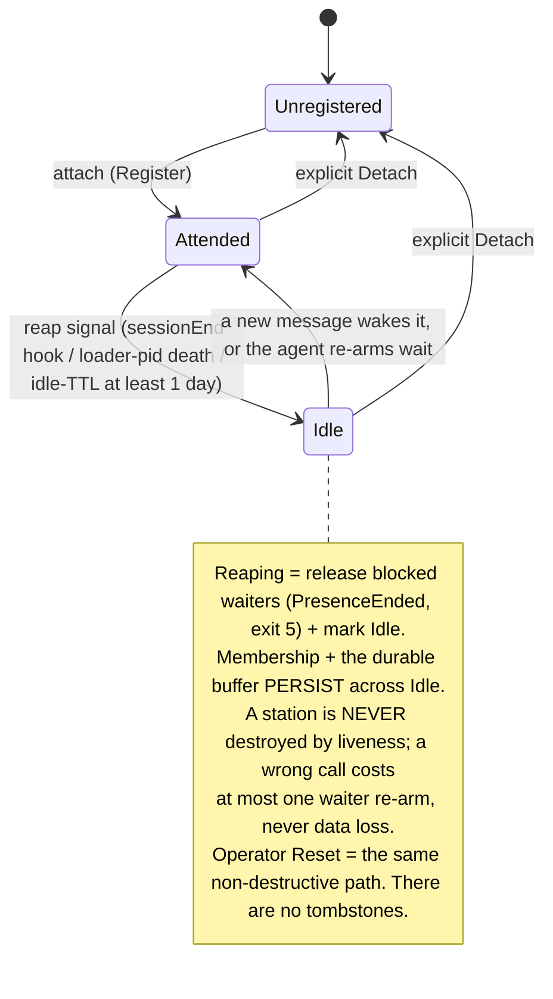
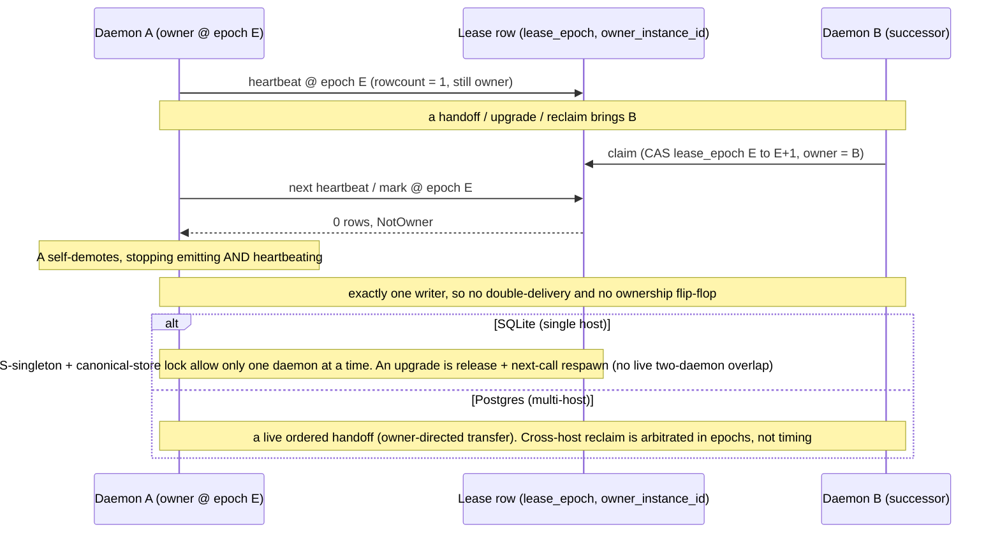
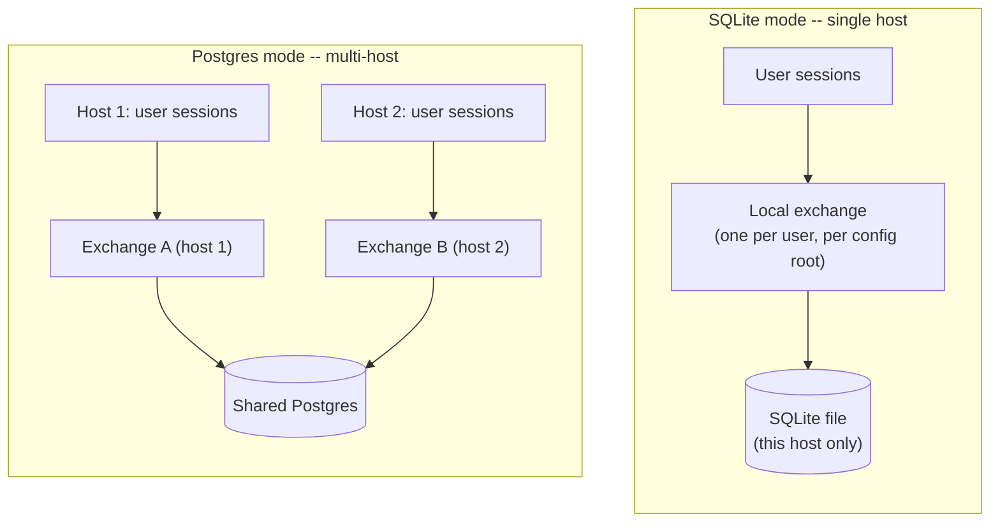
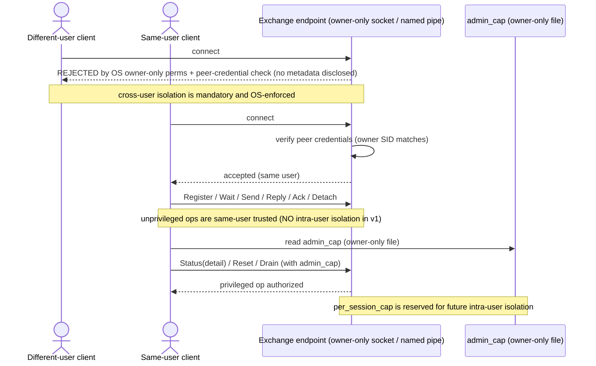

# Telex Local Exchange -- Architecture Overview (visual)

> **Non-normative explanatory diagrams.** These teach the local-exchange architecture; the
> governing specification is [`daemon.md`](daemon.md). **If any diagram conflicts with `daemon.md`,
> `daemon.md` wins.** Each diagram below names the `daemon.md` section(s) it is drawn from.

This is the **visual on-ramp** to the daemon design: read it before the normative contract to build
a mental model, then drop into [`daemon.md`](daemon.md) for the precise rules. The diagrams, in
learning order:

1. **Component map** -- what the pieces are and how the daemon comes to exist.
2. **Message delivery (one exchange)** -- how a message reaches a recipient at-least-once, and when
   it is "consumed".
3. **Cross-exchange delivery (remote Postgres)** -- the same fence when sender and recipient are on
   different hosts, with Postgres as the shared transport.
4. **Restart & re-attach** -- what a daemon restart loses vs. retains, and how a station recovers.
5. **Station liveness** -- how a station is deemed idle, and why that is never destructive.
6. **Single-writer correctness** -- how exactly one writer per store is guaranteed across restart,
   upgrade, and multi-host.
7. **Deployment topology** -- where exchanges live: SQLite single-host vs Postgres multi-host.
8. **Authorization & the OS trust boundary** -- who may talk to the exchange, and what needs a capability.

The word **epoch** appears by name in diagrams 2-3 and is *defined* in diagram 6 (the single-writer
fence).

---

## 1. Local exchange component map

**Answers:** What are the pieces, where is the per-user singleton boundary, and how does the daemon
come to exist with no manual start command?



Sessions run **one-shot verbs** (no resident process). A **station** is a registration in the
exchange: a durable lease row plus the in-memory attendance record. The exchange is the only writer
of liveness/delivery state for its store.

*Governing spec:* [daemon.md sec.1](daemon.md#1-the-local-exchange) ,
[sec.2.2 auto-spawn](daemon.md#22-auto-spawn-connect-or-spawn-and-the-spawn-lock)

---

## 2. Message delivery & the at-least-once fence

**Answers:** When a sender and recipient share one local exchange, how does a message reach the recipient at-least-once, and when is it "consumed"? (The cross-host case is diagram 3.)



The durable `deliveries` row is the dedup source of truth. The **stdout PRINT is transport only**;
the **agent's explicit `ack` is the durable fence** (a single ack -- there is no separate waiter
`DeliveryAck`). "Consumed" is decided by the agent, epoch-guarded so a superseded daemon cannot mark.

*Governing spec:* [daemon.md sec.11.3 delivery fence](daemon.md#113-server-side-delivery-fence-mr1--at-least-once-preserving) ,
[sec.13 dedup](daemon.md#13-delivery-and-seen-dedup)

---

## 3. Cross-exchange delivery via remote Postgres

**Answers:** When the sender and recipient are on different hosts (each with its own local exchange)
sharing one Postgres, how does a message cross between them, and which exchange marks it consumed?



Postgres is the **shared transport** between per-host exchanges. The **sender's** exchange only
writes the durable delivery row; the **recipient's** exchange (whichever holds that recipient's
lease) is the one that EMITs and -- epoch-guarded -- marks it consumed. The same at-least-once +
explicit-ack fence as diagram 2 holds end-to-end; only the delivering/marking exchange differs.

*Governing spec:* [daemon.md sec.11.3 delivery fence](daemon.md#113-server-side-delivery-fence-mr1--at-least-once-preserving) ,
[sec.11.5 cross-machine reclaim](daemon.md#115-postgres-cross-machine-reclaim-in-epochs-not-timing)

---

## 4. Restart & re-attach recovery

**Answers:** After a daemon restart, what is lost vs. retained, and how does a station regain
membership?



Recovery is an **ordered handshake**, not an automatic rebuild: the exchange never reverse-indexes
durable rows into membership. The agent is told (`NeedsAttach`) and re-establishes exactly the
addresses it wants.

*Governing spec:* [daemon.md sec.14.3 crash recovery](daemon.md#143-crash-recovery-and-re-attach) ,
[sec.14.4 NeedsAttach](daemon.md#144-wait-and-re-attach-on-needsattach)

---

## 5. Station liveness states (non-destructive reaping)

**Answers:** How is a station deemed idle, and why is that never destructive?



Liveness is a **non-destructive UX dial, not a correctness gate**. There is deliberately **no
Destroyed state**: a station can idle for days and wake on the next message.

*Governing spec:* [daemon.md sec.9 liveness](daemon.md#9-liveness-model) ,
[sec.10 reaping + idle-TTL](daemon.md#10-reaping-and-the-idle-ttl-backstop)

---

## 6. Single-writer correctness: the epoch fence + ownership handoff

**Answers:** How does telex guarantee exactly one writer per store across restart, upgrade, and
multi-host?

An **epoch** is the single-writer fence: a monotonic `lease_epoch` plus the owning daemon's
`owner_instance_id`. A successor wins by atomically incrementing the epoch; the old owner discovers
it has been superseded on its next write and steps down.



Three layers enforce single-writer: the **OS-singleton** (per config root), a **canonical-store
lock** (per SQLite store), and the **lease-epoch fence** (the multi-writer Postgres authority).

*Governing spec:* [daemon.md sec.11 lease-epoch fence](daemon.md#11-lease-epoch-fence-the-spine) ,
[sec.11.4 ordered handoff](daemon.md#114-ordered-handoff--owner-directed-atomic-transfer-sf3)

---

## 7. Deployment topology (SQLite single-host vs Postgres multi-host)

**Answers:** Where do exchanges live, and how does the backend choice change the picture across hosts?



SQLite is **single-host**: one exchange, one file, no cross-host path. Postgres is the **multi-host
substrate**: one exchange per `(user, host)`, all sharing one Postgres. The OS-singleton +
canonical-store lock keep exactly one exchange per config root; the **lease-epoch fence** arbitrates
the multi-writer Postgres, and cross-host delivery flows through it (diagrams 3 and 6).

*Governing spec:* [daemon.md sec.2.1 singleton identity](daemon.md#21-singleton-identity) ,
[sec.11 lease-epoch fence](daemon.md#11-lease-epoch-fence-the-spine)

---

## 8. Authorization & the OS trust boundary

**Answers:** Who is allowed to talk to the exchange, and which operations need a capability?



v1 trust is **same-user, user-private**: a different OS user cannot connect, read the capability, or
wait on an address (OS-enforced). Within the user, every process is trusted -- unprivileged verbs
need no capability, while the privileged verbs (`Status{detail}`, `Reset`, `Drain`) require the
owner-only `admin_cap`. Intra-user isolation (`per_session_cap`) is reserved, not in v1.

*Governing spec:* [daemon.md sec.7 authorization](daemon.md#7-authorization-and-the-trust-boundary) ,
[sec.7.2 OS trust boundary](daemon.md#72-os-level-trust-boundary-mr5)

---

## 9. Push delivery (on-deliver exec + in-session bridge)

**Answers:** How does a message reach a harness that cannot keep a blocking `wait` armed — without the agent owning a listener, and without the daemon learning anything about that harness? (Contrast diagram 2, which is pull.)

```mermaid
sequenceDiagram
    actor S as Sender session
    participant X as Local exchange (daemon)
    participant DB as deliveries(message_id, recipient)
    participant P as telex copilot push (opaque argv)
    participant B as In-session bridge (extension)
    actor R as Recipient agent turn

    S->>X: send / reply (message)
    X->>DB: INSERT (message_id, recipient) -- durable
    Note over X: on-deliver fires AFTER durable commit + wait-notify, PRIMARY recipient only, off the ack path
    X->>P: exec argv, harness-neutral descriptor on stdin
    P->>P: derive session bridge endpoint (NOT trusted from registry path)
    P->>B: connect (named pipe / UDS, same-user)
    B-->>R: session.send -> message arrives as a TURN (immediate | enqueue)
    R->>X: ack (message_id, address)
    X->>DB: epoch-guarded MARK consumed
    Note over X,P: on-deliver is LIVENESS-ONLY -- it never marks delivered/consumed; a missed/failed/duplicate push just re-surfaces (at-least-once)
```

Push is a **wake**, not a second delivery path: the durable buffer and the agent-`ack` fence (diagram 2)
are unchanged. The daemon runs an **opaque argv** (`telex copilot push`) with the harness-neutral message
descriptor on stdin the moment a message is durably committed for the **primary** recipient (**never** cc);
everything Copilot-specific -- deriving the session's bridge endpoint, the in-session extension bridge, and
mapping attention to `immediate`/`enqueue` turn injection -- lives **outside** the daemon. A per-heartbeat
bounded sweep retries a push whose target was briefly absent. This removes the deaf-station failure mode (a
missed waiter re-arm) for push-capable sessions, while `wait` (diagram 2) remains the harness-agnostic pull
fallback.

*Governing spec:* [daemon.md sec.13.2 on-deliver push](daemon.md#132-on-deliver-push-opt-in-harness-neutral) ,
[copilot-bridge-push.md](copilot-bridge-push.md) ,
[DECISIONS.md ADR 0039](DECISIONS.md#0039--push-delivery-via-a-generic-on-deliver-exec--copilot-session-bridge)
